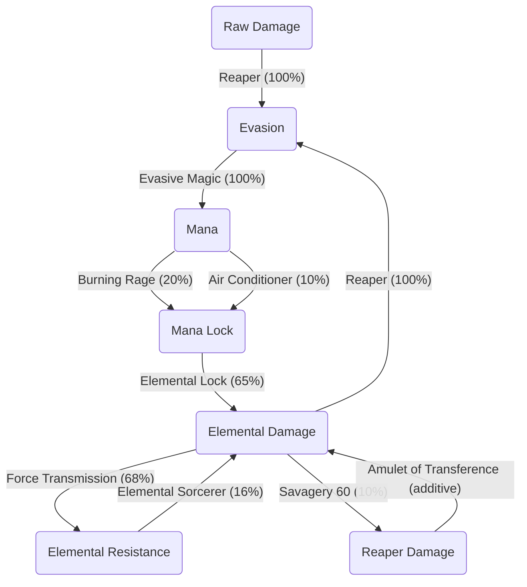

# Introduction
If you want to "play" a build without actually having to press button, this build is for you.

## Pros & Cons

### Pro
- Very easy to play. Probably the easiest to play (like, you have nothing to do)
- Damage scale well with gear
- (Ab)use conversion, so the damage scale quickly

### Cons
- Can be quite expansive to min max
- The survivability is not so high. Most of them come with the primordial

# Core mechanics

We are gonna build evasion, which will be converted to mana, which will be converted to elemental damage, to (kinda) absurd level.

The build is a loop conversion, this mean that we are converting a stat A to a stat B to a stat C back to a stat A again. The dev are aware of that, and they disable the loop process. Each loop conversion in the game is at the moment disabled (if not you can reach overflow number ...)

We are gonna (behold the abusive conversion):

## Evasion stacking
### Primordial Bow of the Untouchable One

_The reaper let you have more evasion the more Raw damage you have, and the more elemental damage you have_

### Hearth of Darkness

# Link for my current version of the build
<a href="https://cayrac.github.io/slorm-planner/view/build/aWxWgotjaFnFwEObaCiqTc1Obub8cLq_uofwad7enreurPKHrkcs0e0roQalWbpag9yjkcPGYicpQdIHbqrMeYHsicVam7a6Wepas7bt0G7eharmMUaFmGHiGKksczxfbLyugbrqlkGaiza9clGiMtBajgtyKuKeGgqtk3OmRcGWkkbzuaaRilWqCaqYaetjQceIcqPijLCugvHqyffaSQabPKh3ioakzacjK2baXbiceeYUkdcqOmuIGwvaaaae7ehagmGbeYBKLCGKvIcyffbHiugkrqlkGaqzc9cdGiMtyapgqqKqsfjbmRIGYSkdaOOfLqaLmHVbbGeJiirioQqPijLCugvHqyffaSQadzKp3imaKzbcjb0AfjbmRIGYSkdaOOfLqaNSIpbbGeJiirioXqPijLCugvHqyffaSQacvKt3imaIznosUqskXbmcIGWKkdfiOfLqaaacVbbGetjQYkscrxijLyugbrqysfaSQaa8Km7bSGabKaaaqeau1qdba0a" target="_blank">Planner link here</a>

